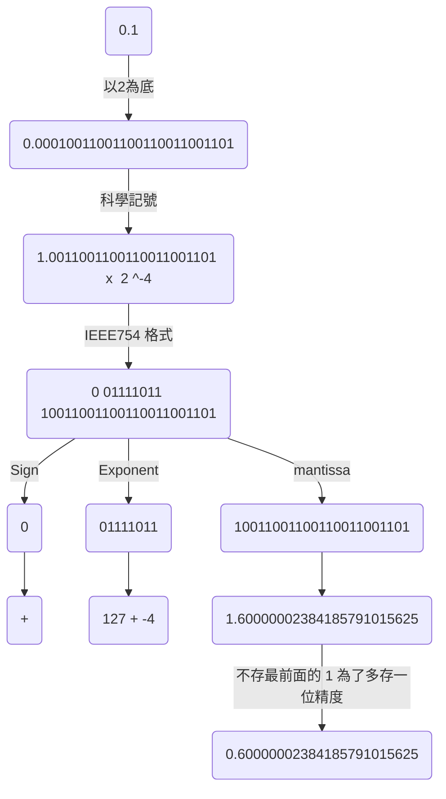
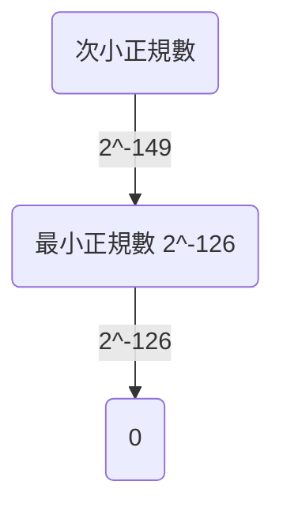

# 請參考本人的網站
[coding-hub IEEE ](https://lovelessless99.github.io/coding-hub/views/IEEE%20754/IEEE754.html#chapter-0-%E5%BC%95%E8%A8%80-%E5%A5%87%E6%80%AA%E7%9A%84%E6%B5%AE%E9%BB%9E%E6%95%B8%E9%81%8B%E7%AE%97)

# 深入了解浮點數 IEEE 754

## Chapter 0. 引言 - 奇怪的浮點數運算
首先，先來個小小震撼教育吧
:::: tabs
::: tab python
```python
print( f"0.1 + 0.7 = {0.1 + 0.7}")
print( f"0.1 + 0.2 = {0.1 + 0.2}")
```
:::

::: tab console
```
0.1 + 0.7 = 0.7999999999999999
0.1 + 0.2 = 0.30000000000000004
```
:::
::::

為什麼會跟我們想的有點落差呢 ? 這邊先破題一下，原因是因為我們在電腦裡面 ==只有有限位元(32 bits 或 64 bits)去表示數字，在浮點數的計算時會捨去一些精度，造成計算的誤差==，接下來就來介紹浮點數的辣些事情😀
::: warning
在本文中，以 32 位元浮點數為例子
:::


## Chapter 1 : IEEE 754 32 bits format

### 1.1 IEEE 754 格式介紹


* sign：最左側的 1 bit 代表正負號，正數的話 sign 就為 0，反之則是 1
* exponent：中間的 8 bit 代表正規化後的次方數，採用的是 超127 格式，也就是 3 還要加上 127 = 130
* fraction：最右側的 23 bit 放的是小數部分，以 1.0001 來說就是去掉 1. 之後的 0001

::: tip
等等會闡述為何要 +127 的 bias
:::


例如要表示 8.5 的話


::: tip
這兩個美麗的圖片跟敘述來自[這個網站](https://medium.com/starbugs/see-why-floating-point-error-can-not-be-avoided-from-ieee-754-809720b32175)
:::

另外，以 0.1為例的話，來看看我畫的美麗的流程吧😀

兩點再次注意
* IEEE 754 存放指數位(Exponent)時，會 ==把指數做 + 127 bias== 的動作
* 存放小數位(fraction or mantissa)時，==不會存最前面的 1，為了多存一位精度，但要換算回原來的數時要記得加回來==

### 1.2 程式碼範例
接下來就來兩個例子，首先來個簡單的 1.0
:::: tabs
::: tab python
```python
import bitstring
f1 = bitstring.BitArray(float=1.0, length=32)
sign = f1.bin[0]   # 1 bit
exp  = f1.bin[1:9] # 8 bits
frac = f1.bin[9:]  # 23 bits
print(sign, exp, frac)
```
:::

::: tab console
```
0 01111111 00000000000000000000000
```
:::

::::

可以想像的到，因為 $1.0 = 2^{0}$ ，所以 $0 + 127(bias)= 127 = 01111111_{2}$

接下來是比較困難的 0.1了，我們要來 ==逆推==
:::: tabs
::: tab python
```python
# 計算 0.1 的二進位
frac = "10011001100110011001101"
value = 0
start = 1 # 從 1/2 ^ 1 開始
for bit in frac:
        value += int(bit) * 0.5 ** start
        start += 1
print( f"fraction :  { value + 1 }")
print( f"Value actually stored in float  :  { (value + 1) * 2 ** ( 123 - 127) }")
```
:::

::: tab console
```
fraction :  1.600000023841858
Value actually stored in float  :  0.10000000149011612
```
:::

::::
回推過程如下
1. 因為前面所看到，0.1 的IEEE 754 指數位為 $01111011_{2} = 123 = 127 + (-4)$，推得 -4 是原來的指數
2. 再來因為我們在儲存fraction欄位時把最前面的 1 給捨去為了儲存多一位的精度，所以推回來時要再加回來
因此 $fraction = 1_{10} + 10011001100110011001101_{2} = 1_{10} + 0.600000023841858_{10}$
3. 最後我們實際上所儲存的 32 bits的 0.1 就是 $1.600000023841858\times2^{-4}=0.10000000149011612$

因此，與我們理想中的 0.1 真的有些誤差，誤差出現的地方是將十進制轉成二進制時，我們只有有限的bits表示浮點數，而在 C 語言的 printf 預設顯示精度是6位數，所以你printf 0.1時會是 0.100000
好，介紹完浮點數的誤差來源後，就來解惑一下 ==為什麼 IEEE 754 指數要 +127 bias==

:::tip
Question 1: 為什麼 IEEE 754 指數要 +127 bias ?

根據 [IEEE 754 Wiki](https://zh.wikipedia.org/wiki/IEEE_754)
>採用指數的實際值加上固定的偏移值的辦法表示浮點數的指數，好處是可以用長度為e個位元的無符號整數來表示所有的指數取值，這使得兩個浮點數的指數大小的比較更為容易，實際上可以按照字典次序比較兩個浮點表示的大小。

關鍵是在於無符號整數(unsigned int)，+127 相當把全部的數字做一個平移，全部變成正數，就很好做比較了，反過來說，試想原本沒有加 127, 如果指數有正有負，是 sined bits，如果當成 unsigned int 來比較指數位 8 bits, 負的首位元是 1 一定比正的大，我們想要floating points 比較時直接當作 unsigned int 比較，因此原本 -126(Question 2) ~ +127，變成 1 (最小的正規數) ~ 254(最大的正規數)
:::

:::tip
Question 2: 為何最小指數次方 -126 ?

因為如果指數欄位 8 個 bits 全都是 0， 代表非正規化數，所以正規化 exponent 是從 00000001 開始，扣掉 127 = -126
:::

### 1.3  結論
* 誤差來源 : 浮點數十進制轉二進制，且只有有限欄位表示
* 浮點數欄位為了多一位精度，儲存時把最前面的 1 捨去，之後換算時要加回來
* 指數欄位 + 127 : 比較兩個浮點數大小時，為了方便直接比較指數位，把全部數字做平移變成 unsigned int，是一個高端的手法😎

----
## Chapter 2. 實作 ! 浮點數的轉換程式

### 2.1 浮點數轉成 IEEE 754 格式
::::tabs
::: tab python
```python
def float_2_IEEE754(float_num):
        bit_pattern = bitstring.BitArray(float=float_num, length=32)
        sign = bit_pattern.bin[0]   # 1 bit
        exp  = bit_pattern.bin[1:9] # 8 bits
        frac = bit_pattern.bin[9:]  # 23 bits
        print(f"Float number: {float_num}  ", sign, exp, frac, 
              f"Actually stored Value = {bit_pattern.float}")

float_2_IEEE754(0.1)
float_2_IEEE754(0.2)
float_2_IEEE754(0.3)
```
:::


::: tab console
```
Float number: 0.1   0 01111011 10011001100110011001101 Actually stored Value = 0.10000000149011612
Float number: 0.2   0 01111100 10011001100110011001101 Actually stored Value = 0.20000000298023224
Float number: 0.3   0 01111101 00110011001100110011010 Actually stored Value = 0.30000001192092896
```
:::
::::

當然，這裡也有 C 語言的實作方法，就是使用到我們不常用的 `union`，可以讓我們的快速得到該欄位的值。這裡要注意的是結構體的宣告，==因為我們現在電腦大部分是 "little-endian"，所以在宣告欄位時要注意欄位順序!==

::::tabs
::: tab C
```C {3-10}
#include <stdio.h>

typedef union Float32 {
    struct {
        unsigned fraction : 23;
        unsigned exponent : 8 ;
        unsigned sign     : 1 ;
    };  
    float num;
}Float32;

void print_binary(unsigned int number)
{
    if (number >> 1) {
        print_binary(number >> 1);
    }
    putc((number & 1) ? '1' : '0', stdout);
}

int main()
{
    Float32 a;
    a.num = 0.1;
    printf("sign: ")    ;print_binary(a.sign)    ; printf(" ");
    printf("exponent: ");print_binary(a.exponent); printf(" ");
    printf("fraction: ");print_binary(a.fraction); printf(" \n");
    return 0;
}
```
:::

::: tab console
```
sign: 0 exponent: 01111011 fraction: 10011001100110011001101
```
::::

### 2.2 IEEE 754 格式轉成浮點數 
:::: tabs
::: tab python
```python
def bit_2_float(bit_string):
        sign = bit_string[0]   # 1 bit
        exp  = bit_string[1:9] # 8 bits
        frac = bit_string[9:]  # 23 bits

        power = int(exp, 2) - 127
        value = 0
        start = 1 # 從 1/2 ^ 1 開始
        for bit in frac:
                value += int(bit) * 0.5 ** start
                start += 1
        
        return ( 1 + value) * 2 ** power

test_bitstr = "00111110100110011001100110011010" # 0.3
bit_2_float(test_bitstr)
```
:::
::: tab console
```
0.30000001192092896
```
:::

::::

### 2.3 多一些些觀察
$\pm 0.0, \pm1.0$
:::: tabs
::: tab python
```python
float_2_IEEE754(+0.0)
float_2_IEEE754(-0.0)
float_2_IEEE754(+1.0) #  1.0 * 2 ** 0  (127 - 127)
float_2_IEEE754(-1.0) # -1.0 * 2 ** 0 (127 - 127)
```
:::
::: tab console
```
Float number:  0.0   0 00000000 00000000000000000000000 Actually stored Value =  0.0
Float number: -0.0   1 00000000 00000000000000000000000 Actually stored Value = -0.0
Float number:  1.0   0 01111111 00000000000000000000000 Actually stored Value =  1.0
Float number: -1.0   1 01111111 00000000000000000000000 Actually stored Value = -1.0
```
:::
::::

2. $Nan, inf$
:::: tabs
::: tab python
```python
import numpy as np
float_2_IEEE754(np.nan)
float_2_IEEE754(np.inf)
```
:::
::: tab console
```
Float number: nan   0 11111111 10000000000000000000000 Actually stored Value = nan
Float number: inf   0 11111111 00000000000000000000000 Actually stored Value = inf
```
:::

* not a number (nan) : 指數全為 1 而分數不等於 0，而且 nan != nan
* infinity : 指數全為 1 而 分數等於 0
::::

----
## Chapter 3. 32 bits 浮點數的安全範圍
### 3.1 浮點數安全範圍
一樣先來個小小的震撼教育🙂

:::: tabs
::: tab python
```python
float_2_IEEE754(123456789)
```
:::

::: tab console
```
Float number: 123456789   0 10011001 11010110111100110100011 Actually stored Value = 123456792.0
```
:::

在指定 32 bits 浮點數為 123456789 時，可看到實際儲存不是123456789，而是123456792，為什麼 ?
::::


首先我們試著把 123456789 轉成二進制
:::: tabs
::: tab python
```python
test_str = bin(123456789)[2:] # remove 0b prefix
print(test_str, ", length is", len(test_str))
```
:::

::: tab console
```
111010110111100110100010101 , length is 27
```
:::

我們得到二進制，接下來就如 1.1 那邊的流程轉成 IEEE 754

::::
$$
123456789_{10}
= 111010110111100110100010101_{2}\\
= 1.11010110111100110100010101_{2}\times2^{26}
$$

這時候就會發現一個問題，1 後面有 26 位數，但是我們的 IEEE 754 只允許 23 個 bits。那就只好 ==捨去3 bits 精度==
繼續推導，由上已知
* sign = 0
* exp = 26 + 127 = 153 ( 10011001 )
* frac = 7043491 ( 11010110111100110100010 )

所以 $123456789$  在IEEE 754 表示為 $0 10011001 11010110111100110100011$，然而因為我們 ==剛剛因為位元數的限制，捨去精度==
所以當把這個 bitstring 轉回原數值時


:::: tabs
::: tab python
```python
bit_2_float("01001100111010110111100110100011")
```
:::

::: tab console
```
123456792.0
```
:::

可以看到，由於向上捨入 3 bits，造成一些精度被丟失，所以無法正確儲存 123456789
::::

::: tip
Questions: 如果你觀察到的話，因為精度的捨去，我們浮點數其實是離散的，雖然在安全範圍內是連續的，但是安全範圍外卻是離散的，那安全範圍是 ?

只要能在 23 bits 內表示的話 ( fraction 23 bits )，那就不會被捨入而丟失精度，因此，單精度安全範圍內最大整數是後面 23 bits 全 1 ( 8388607 ), 

$1.11111111111111111111111\times2^{23} = 16777215$
:::

:::: tabs
::: tab python
```python
int('1' * (23 + 1), 2) # 故意寫 1 + 23 因為我們要把 1 加回來
```
:::
::: tab console
```
16777215
```
:::
::::

只要小於等於 $16777215$ 整數範圍內，都是連續的，接下來都是離散的，請看例子

:::: tabs
::: tab python
```python
for i in range(10):
        value = 16777212 + i
        bit_pattern = bitstring.BitArray(float=value, length=32)
        store_value = bit_2_float(bit_pattern.bin)
        print(value, ":", store_value)
```
:::
::: tab console
```
16777212 : 16777212.0
16777213 : 16777213.0
16777214 : 16777214.0
16777215 : 16777215.0
16777216 : 16777216.0 <--- 開始發散
16777217 : 16777216.0
16777218 : 16777218.0
16777219 : 16777220.0
16777220 : 16777220.0
16777221 : 16777220.0
```
:::

可以看到從 16777216 就開始逐漸發散 !
浮點數真是要處處小心精度陷阱，是吧?🤣
::::

### 3.2 浮點數的密度 - 看圖說故事
這裡來展現幾張圖

上圖可以看到，浮點數隨著超過安全距離越多，越加發散，表示浮點數並非均勻分布的，數值越小，浮點數越多(下一章非正規浮點數可以看到)


上圖可以看到，橫軸是指數，縱軸是浮點數值，隨著指數越大，數值也跟著越大，同時也更加離散

我們也可以動手用 python 畫畫看
:::: tabs
::: tab python
```python
import seaborn as sns
significand_bits = 4

expon_max, expon_min = 4, -3
fp_numbers = []

for sign_bit in [1, 0]:
        for exp in range(expon_min, expon_max + 1):
                for bits in range(0, 2**significand_bits):
                        significand = (-1)**(sign_bit) * ( 1 + bits / 2**significand_bits ) * 2 ** exp
                        fp_numbers.append(significand)

fp_numbers = np.array(fp_numbers)

sns.set()
plt.plot(fp_numbers, np.ones_like(fp_numbers), "x")
plt.show()
```
:::

::: tab console

:::
::::


## Chapter 4. 非正規(Denormalized)浮點數

::: tip
來段非正規浮點數的自介

* 如果浮點數的指數部分的 編碼值是0，分數部分非零，那麼這個浮點數將被稱為非正規形式的浮點數
* 一般是某個數字相當接近零時才會使用非正規格式來表示。
* IEEE 754標準規定：非正規的浮點數的指數偏移值比正規形式的浮點數的指數偏移值小1。
* 漸進式下溢位（gradual underflow）
* 用來解決填補絕對值意義下最小正規數與零的距離。（舉例說，正數下，最大的非規格數等於最小的規格數。而一個浮點數編碼中，如果exponent=0，且尾數部分不為零，那麼就按照非正規浮點數來解析）
:::

介紹完了，是不是似懂非懂哈哈🤣，簡單來說，我們必須使用非正規化浮點數，==使最小的正規數與 0 的距離可以更平滑，達到漸進式下溢位，而在漸進0的過程中，我們使用非正規化浮點數，又可以儲存更小的數==。

首先，先來看正規化浮點數的最大值與最小值

:::: tabs
::: tab python
```python
# min normalize number
float_2_IEEE754(2**-126)

# max normalize number
max_normal_float = bit_2_float("01111111011111111111111111111111")
float_2_IEEE754(max_normal_float)
```
::: tab console
```
Float number: 1.1754943508222875e-38   0 00000001 00000000000000000000000 Actually stored Value = 1.1754943508222875e-38
Float number: 3.4028234663852886e+38   0 11111110 11111111111111111111111 Actually stored Value = 3.4028234663852886e+38
```
::: tab console

:::
1. 為什麼最小是 $2^{-126}$ ? 因為 指數域 $00000001_{2}$ 不能再往下降了，全部都是 0 的話就是非正規化浮點數

    * 因此小於 $1.1754943508222875e^{-38}$ underflow

2. 為什麼最大是 $0 11111110 11111111111111111111111_{2}$ ? 因為指數域不能再上升了，指數域全部都是 1 ，小數域全0 就是IEEE 754的無限大
    * 因此大於 $3.4028234663852886e+38$ 為 overflow
::::

再來看為什麼要提到 ==平滑==，這裡問題也可以參考[這篇問答](https://www.quora.com/Why-is-2-149-the-smallest-normalized-gap-in-the-IEEE-754-single-precision-format)

我們再來看最小及次小的正規化浮點數

* 最小的正號正規浮點數 : 
Exp = 00000001, Frac = 00000000000000000000000 ---> $2^{-126}$
                                              
* 次小的正號正規浮點數 : 
Exp = 00000001, Frac = 00000000000000000000001
$$
2^{-126}\times (1+ 2 ^{-23}) = 2^{-126} + 2^{-149}
$$ 

所以最小和次小相差 $2^{-149}$，然而如果今天沒有非正規化浮點數的加入，最小的正的正規化數跟 0 相差 $2^{-126}$，掉下去的距離突然距離差了 $2^{23}$，有沒有更優雅的作法 ? 



答案是，非正規浮點數的加入，可以使最小的正規化浮點數不會==急遽==降低，會平滑的降下去

|浮點數|sign|exponent|fraction| 值 |
|------|------|------|------|-------|
|次小正規化|0| 00000001 | 00000000000000000000001 | $(1+ 2 ^{-23}) \times 2^{-126} = 2^{-126} + 2^{-149}$|
|最小正規化|0| 00000001 | 00000000000000000000000 | $2^{-126}$ |
|最大非正規化|0|00000000| 11111111111111111111111 | $(1 - 2^{-23}) \times 2^{-126} = 2^{-126} - 2^{-149}$| 
|最小非正規化|0|00000000| 00000000000000000000001 | $2^{-149}$|

你可以發現現在每個數都是相差 $2^{-149}$，不論是
* 次小正規數 跟 最小正規數
* 最小正規數 跟 最大非正規化
* 最小非正規化 跟 0

這種優美的解決方法，真的是數學之美!😉

## Chapter 5. IEEE 754 總結
1. $F=(-1)^{S} * 2^{(E-127)}* (1 + \frac{M}{2^{23}})$
2. +127 bias 是為了方便直接從 bit string 比較浮點數大小
3. 浮點數在安全範圍內是連續的，超出安全範圍外會發散
4. 浮點數不是均勻分布，數值越小浮點數越多
5. 非正規浮點數的引進優美的解決了最小正規化正浮點數到 0 的距離突然下降的窘境

最後，引進一張漂亮的圖


說明一下 ==本圖是 Z 字型增加的==，綠色(0)接藍色(非正規化浮點數)再接紫色(最小正規化浮點數)，值逐漸上升，依此類推

1. 黃色表示無限大，exp 全 1，且 significand (fraction) 全 0。
2. 紅色表示 NaN ，exp 全 1，且 significand (fraction) 不全為 0
3. 黑色為最大正規化浮點數
4. 紫色(最小正規化浮點數)到綠色(0)太急促下降了，需要藍色(非正規化浮點數)的緩衝慢慢降下去(漸進式下降)

## 參考連結
1. [本篇文章 jupyter notebook 的展示](https://github.com/lovelessless99/IEEE_754_Tutorial/blob/master/Floating_Points.ipynb)
2. [漂亮的浮點數練習網站](https://float.exposed/0x50ffffff)
3. [從 IEEE 754 標準來看為什麼浮點誤差是無法避免的](https://medium.com/starbugs/see-why-floating-point-error-can-not-be-avoided-from-ieee-754-809720b32175)
4. [IEEE 754 Wiki](https://zh.wikipedia.org/wiki/IEEE_754)
5. [IEEE-754 Floating Point Converter](https://www.h-schmidt.net/FloatConverter/IEEE754.html)
6. [IEEE 754 浮點數標準](http://ieee-754.blogspot.com/)
7. [ieee-754 32 bit single precision exponent 126 instead of 127](https://stackoverflow.com/questions/46732247/ieee-754-32-bit-single-precision-exponent-126-instead-of-127) 
8. [揭密浮點數](https://zhuanlan.zhihu.com/p/89320102)
9. [Why is 2^−149  the smallest normalized gap in the IEEE 754 single-precision format?](https://www.quora.com/Why-is-2-149-the-smallest-normalized-gap-in-the-IEEE-754-single-precision-format)